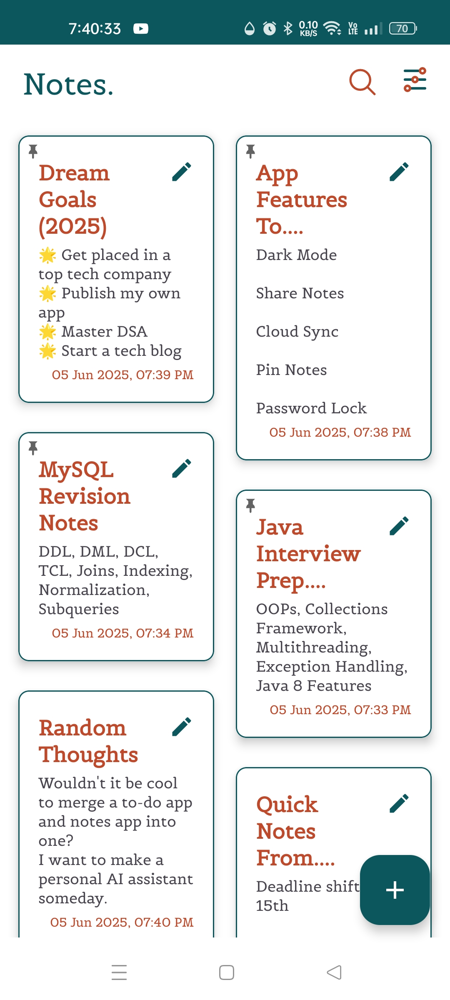
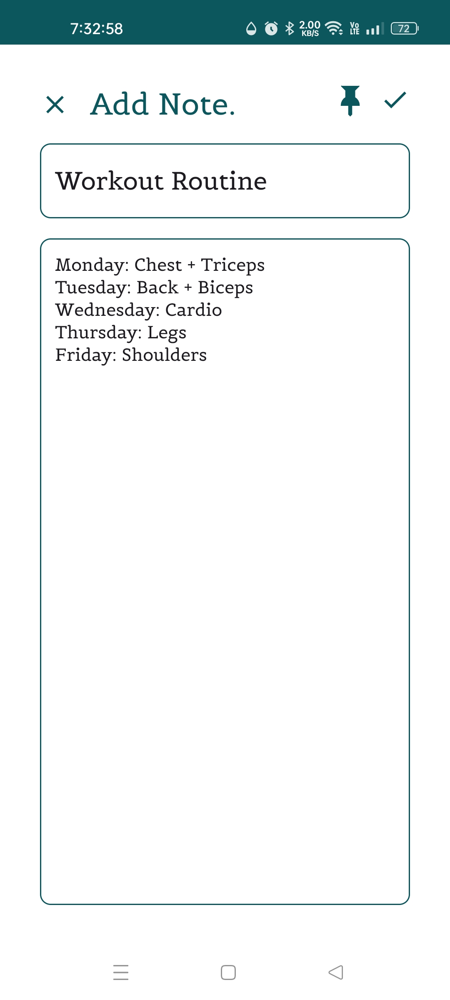
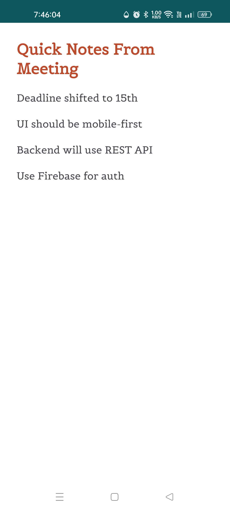

# 🗒️ NoteNinja

NoteNinja is a sleek and intuitive Android note-taking app that helps you organize thoughts, tasks, and ideas with ease. Whether you’re planning your goals, storing code notes, or managing reminders, NoteNinja makes it simple, clean, and productive.

---

## 🔍 Features

- 📝 Create, edit, and view notes
- 📌 Pin important notes to appear at the top
- 🗑️ Bulk delete multiple notes
- 🔍 Search by title
- 📅 Sort notes by date (ascending or descending)
- 📂 Offline storage using SQLite
- 🎨 Minimalist UI with a clean font and intuitive layout

---

## 🧱 Tech Stack

- **Language:** Kotlin
- **UI:** XML Layouts + Material Design
- **Database:** SQLite
- **IDE:** Android Studio
- **Version Control:** Git & GitHub

---

## 📸 App Screenshots

> Below are some key screens from the NoteNinja Android app:

### 🚀 Splash Screen
A clean, simple entry point into the app with brand identity.

---

### 🏠 Main Notes Screen
A beautiful card-based layout showcasing all your notes, pinned ones appear first.

---

### ➕ Add New Note
Create notes with title and content. Tap the pin icon to prioritize.

---

### ✏️ Edit Existing Note
Modify any existing note with one tap.

---

## 📂 Folder Structure

